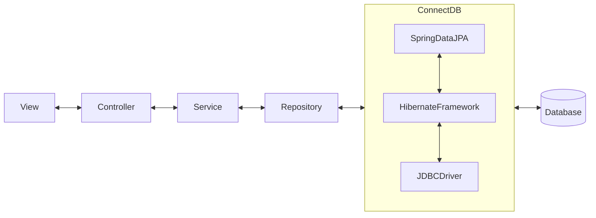

# eCommerce Webapp
Ecommerce webapp developed using Spring Boot and Thymeleaf
***
## Used Technologies

***
## GitHub Statistics

***
## Overview
### Application Architecture

### Project Structure 
<pre>
<b>ecommerce-webapp</b>
├── <b>db</b>
│   ├── data.sql (File script insert data)
│   ├── schema.sql (File script create schema)
├── <b>common</b> (Common module is a shared library between sites)
│   ├── <b>src</b>
│   │   ├── <b>main</b>
│   │   │   ├── <b>java</b>
│   │   │   │   ├── <b>com.ecommerce.common</b>
│   │   │   │   │   ├── annotation (Contains custom annotation classes)
│   │   │   │   │   ├── constant (Contains classes with constant variables)
│   │   │   │   │   ├── exception
│   │   │   │   │   ├── model
│   │   │   │   │   │   ├── dto
│   │   │   │   │   │   ├── entity
│   │   │   │   │   │   ├── enum
│   │   │   │   │   │   ├── ...
│   │   │   │   │   ├── validation (Contains custom validation classes)
├── ...
├── <b>site</b> (Site module for containing admin and shop page)
│   ├── images (Folder images storage in local)
│   ├── <b>admin</b> (Module for admin site)
│   │   ├── <b>src</b>
│   │   │   ├── <b>main</b>
│   │   │   │   ├── <b>java</b>
│   │   │   │   │   ├── <b>com.ecommerce.site.admin</b>
│   │   │   │   │   │   ├── annotation
│   │   │   │   │   │   ├── config (Contains web configuration classes)
│   │   │   │   │   │   ├── constant
│   │   │   │   │   │   ├── controller (Contains controller classes)
│   │   │   │   │   │   ├── exception
│   │   │   │   │   │   ├── export (Contains classes for export to documents)
│   │   │   │   │   │   ├── helper (Contains helpful classes for cleaner code)
│   │   │   │   │   │   ├── repository (Contains repository classes)
│   │   │   │   │   │   ├── rest (Contains REST controller classes)
│   │   │   │   │   │   ├── security (Contains custom security classes and implementations)
│   │   │   │   │   │   ├── service (Contains service classes)
│   │   │   │   │   │   ├── utils (Contains utility classes)
│   │   │   │   ├── <b>resources</b>
│   │   │   │   │   ├── i18n (Contains messages properties for internationalization)
│   │   │   │   │   ├── keystore (Contains local SSL key & certification)
│   │   │   │   │   ├── static
│   │   │   │   │   │   ├── css
│   │   │   │   │   │   ├── img
│   │   │   │   │   │   ├── js
│   │   │   │   │   │   ├── ...
│   │   │   │   │   ├── templates
│   │   │   │   │   ├── ... (.properties)
│   │   │   │   │   ├── logback.xml

│   ├── <b>shop</b>
│   │   ├── <b>src</b>
│   │   │   ├── <b>main</b>
│   │   │   │   ├── <b>java</b>
│   │   │   │   │   ├── <b>com.ecommerce.site.shop</b>
├── ... (The package structure is the same as admin site)
</pre>

### Dependencies
The [pom.xml](site/pom.xml) in site module shares general libraries between sites modules.
But the pom.xml in each site modules will contain specific dependencies that depend on building its own site. Here is a summary dependencies list.

* **Developer Tools**:
  * [Spring Boot DevTools](https://docs.spring.io/spring-boot/docs/current/reference/htmlsingle/#using.devtools)
  * [Lombok](https://projectlombok.org/features/)
* **Web**:
  * [Spring Web](https://docs.spring.io/spring-boot/docs/current/reference/htmlsingle/#web)
  * [Spring AOP](https://docs.spring.io/spring-framework/docs/current/reference/html/core.html#aop-api)
* **Template Engines**:
  * [Thymeleaf](https://docs.spring.io/spring-boot/docs/current/reference/htmlsingle/#web.servlet.spring-mvc.template-engines)
* **Security**:
  * [Spring Security](https://docs.spring.io/spring-boot/docs/current/reference/htmlsingle/#web.security)
  * [OAuth2 Client](https://docs.spring.io/spring-boot/docs/current/reference/htmlsingle/#web.security.oauth2.client)
  * [Jasypt](https://github.com/ulisesbocchio/jasypt-spring-boot) - Jasypt Spring Boot provides Encryption support for property sources in Spring Boot Applications.
* **SQL**:
  * [Spring Data JPA](https://docs.spring.io/spring-boot/docs/current/reference/htmlsingle/#data.sql.jpa-and-spring-data)
  * [Oracle JDBC Driver](https://mvnrepository.com/artifact/com.oracle.database.jdbc/ojdbc8)
* **I/O**:
  * [Validation](https://docs.spring.io/spring-boot/docs/current/reference/htmlsingle/#io.validation)
  * [Java Mail Sender](https://docs.spring.io/spring-boot/docs/current/reference/htmlsingle/#io.email)
* **Build**:
  * [Apache Maven](https://maven.apache.org/)
* **Webjars**:
  * [Bootstrap](https://getbootstrap.com/) - Powerful, extensible, and feature-packed frontend toolkit.
  * [jQuery](https://jquery.com/) - jQuery is a fast, small, and feature-rich JavaScript library.
  * [Font Awesome](https://fontawesome.com/) - Font Awesome is the Internet's icon library and toolkit, used by millions of designers, developers, and content creators.
  * [Summernote](https://summernote.org/) - Super Simple WYSIWYG Editor on Bootstrap Summernote is a JavaScript library that helps you create WYSIWYG editors online.
* **Others**:
  * [Super CSV](https://github.com/super-csv/super-csv) - Super CSV is a fast, programmer-friendly, open-source library for reading and writing CSV files with Java.
  * [Apache POI](https://poi.apache.org/components/) - The Java API for Microsoft Documents.
  * [Open PDF](https://github.com/LibrePDF/OpenPDF) - Open PDF is an open source Java library for PDF files

### Features
#### For admin site
* Authorization for actors with 5 roles: Admin, Salesperson, Editor, Assistant and Shipper
  * Admin can manage everything.
  * Salesperson can only manage product price, customers, shipping, orders and sales report.
  * Editor can only manage category, brands, products, articles and menus.
  * Assistant can only manage questions and reviews.
  * Shipper can only view products, view orders and update order status.
* Authentication for login admin page:
  * Inactive user actors can not be sign in (Admin actor cannot be disabled their own activation).
  * With 5 failed attempts, user actors will be locked for 24 hours. 
* CRUD function for manage users only for admin actor. Other actors can only change their account details information.
* CRUD function for manage categories for authorized actors.
* CRUD function for manage brands for authorized actors.
* CRUD function for manage products for authorized actors.
* ... (In process)
#### For shop site
* Authentication with Email validation.
* Authentication with Google, Facebook.
* Customers can search for the product according to the specified criteria.
* Customers can add and delete products from the shopping cart (In process).
* Customers can order the products in the shopping cart (In process).
* Customers can change their password and view their orders (In process).

### Installation
* Download and setup [IntelliJ IDEA](https://www.jetbrains.com/idea/download/#section=windows).
* Download and setup [Oracle Database](https://www.oracle.com/database/technologies/oracle-database-software-downloads.html#19c) and [SQL Developer](https://www.oracle.com/database/sqldeveloper/technologies/download/).
* Clone or download this repository.
* (Optional) Execute schema.sql script to create new schema. Run Spring Boot Application and wait for generate tables (set "spring.jpa.hibernate.ddl-auto=update" if needed) and run data.sql script to insert data.
* Switch to application_prod.properties to connect Oracle database through Amazon RDS service.
* Run and enjoy ☺️.
***
## Note
* Password field of users and customers is encrypted by BCrypt. Use this for login:
    - For user: admin@gmail.com | admin
    - For customer: customer@gmail.com | customer
* Change the smtp_user and smtp_password to yours.

| Variables     | Require | Description                                                                                | Default        |
|---------------|:-------:|--------------------------------------------------------------------------------------------|----------------|
| SMTP_HOST     |    ❌    | The SMTP server to connect to                                                              | smtp.gmail.com |
| SMTP_PORT     |    ❌    | The SMTP server port to connect to, if the connect() method doesn't explicitly specify one | 587            |
| SMTP_USER     |    ✔    | Username for SMTP Authenticator                                                            |                |
| SMTP_PASSWORD |    ✔    | Password for SMTP Authenticator                                                            |                |
***
## Hosting on Heroku
... (In process)
***
## Results
[Click here](doc/overview.pptx) to download documents for more details.
### Diagram
[Click here](site/README.md) to view diagrams.
### Admin application
[Click here](site/admin/README.md) for an overview of the admin page functions and UI.
### Shop application
[Click here](site/shop/README.md) for an overview of the shop page functions and UI.
### Unit Test
[Click here](site/admin/unit-test.md) for an overview of unit test case functions
***
## References

